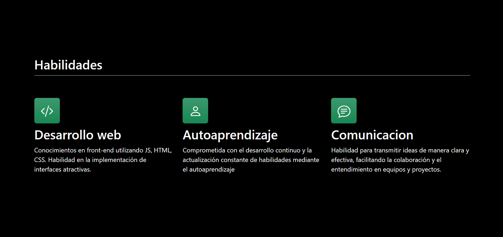
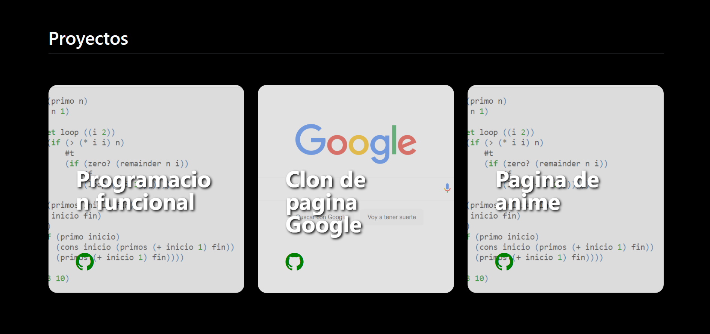

# Mi portafolio de habilidades Technolochicas PRO

El presente proyecto es un portafolio desarrolado para poner en practica las habilidades obtenidas dentro del bootcamp de desarrollo frontend de Technolochicas.

Fue desarrollado con HTML, CSS y JS con el uso de el framework de UI, Bootstrap y utilizando ademas librerias externas.

La pagina es responsiva e incluye la presentacion de la autora del proyecto

[Proyecto desplegado](https://frida-pineda.netlify.app/)

## Secciones de mi sitio

## Tecnologias
* HTML
* CSS
* Bootstrap
* Javascript

--

Desarrollado por Frida Pineda en [TECHNOLOCHICAS PRO](https://tecnolochicas.mx/)